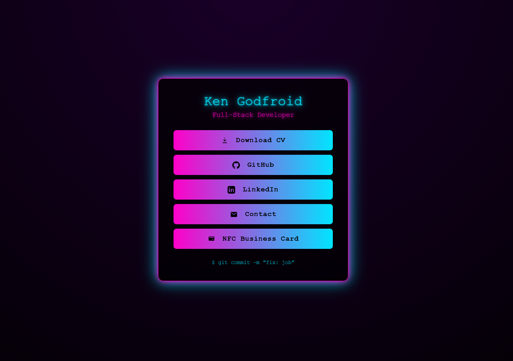
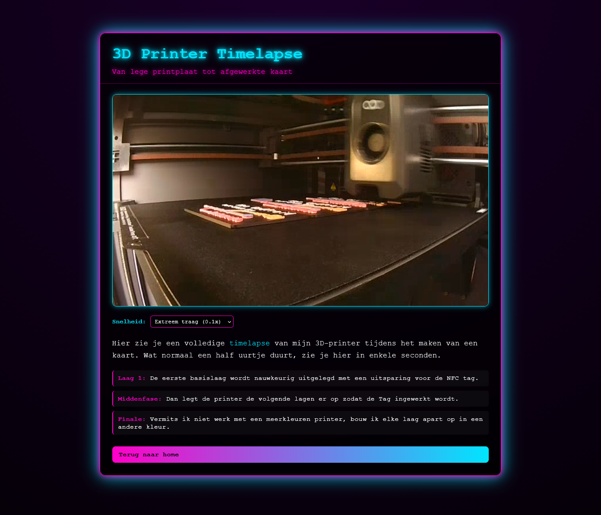

# LandingPage Ken

Persoonlijke landing page van Ken Godfroid, gebouwd als statische HTML/CSS-site.

## Inhoud

- `index.html`: Homepagina met links naar CV, GitHub, LinkedIn, e-mail en de NFC-kaart pagina.
- `MakingOfCards.html`: Pagina met timelapse-video van het 3D-printproces van de kaarten.
- `TimeLapsCards.mp4`: Video die op de Making Of-pagina wordt afgespeeld.
- `cv.pdf`: Downloadbaar CV.
- `favicon.svg`: Favicon van de site.

## Gebruikte technologie

- HTML5
- CSS3
- Een kleine hoeveelheid vanilla JavaScript (voor videosnelheid)

## Lokaal bekijken

1. Open `index.html` in je browser.
2. Navigeer naar de andere pagina via de knop "NFC Business Card".

Tip: voor correcte paden en gedrag kan je ook een eenvoudige lokale server starten (bijvoorbeeld met VS Code Live Server).

## Opmerkingen

- De stijl gebruikt een neon/cyber look met gradients, glow en glassmorphism.
- Beide pagina's zijn responsive en bruikbaar op mobiel en desktop.

## Afbeeldingen

